<div align="center">

# 💼 Shashank Kudha — Developer Portfolio

### Backend Developer Portfolio • Modern React Experience • Responsive Design • Direct Contact Workflow

<a href="https://shashank-portfolio-rust.vercel.app/">
  
</a>

<br/><br/>


<br/>


<br/><br/>

<a href="https://shashank-portfolio-rust.vercel.app/">🌐 Live Demo</a>
&nbsp;&nbsp;•&nbsp;&nbsp;
<a href="https://github.com/ashrithBalaji456/Shashank_Portfolio">📦 Source Code</a>

</div>

---

## 📌 Project Overview

**Shashank Portfolio** is a modern, responsive, single-page developer portfolio built with **React 19** and **Vite 5**.

The website presents **Shashank Kudha** as a backend developer specializing in technologies such as Java, Spring Boot, Spring Security, REST APIs and PostgreSQL.

Rather than functioning as a simple static résumé, the portfolio creates a complete visitor journey:

> **Landing Page → Professional Introduction → Technical Identity → About → Skills → Experience → Projects → Resume Download → Social Profiles → Contact Form → Email Delivery**

The application combines a professional developer-focused interface with responsive layouts, glassmorphism, theme switching, interactive technology icons, social profile navigation, résumé access and an AJAX-based contact workflow.

---

## 🌐 Live Application

<div align="center">

### 🚀 Experience the Portfolio

<a href="https://shashank-portfolio-rust.vercel.app/">
  
</a>

</div>

---

## ✨ Key Features

- Responsive single-page portfolio experience
- Backend-developer-focused personal branding
- Hero section with professional introduction
- Smooth section-based navigation
- Desktop and mobile navigation experiences
- Dark and light theme support
- Glassmorphic cards and surfaces
- Premium technology icon interactions
- Individual brand-inspired icon glow effects
- Skills and technology presentation
- Professional experience section
- Project showcase
- Education and career information
- GitHub profile integration
- LinkedIn profile integration
- Downloadable résumé
- Contact form with asynchronous submission
- Success and failure feedback states
- Responsive layouts for desktop, tablet and mobile
- SEO-oriented title and metadata
- Vercel deployment

---

## 🏗️ Application Architecture

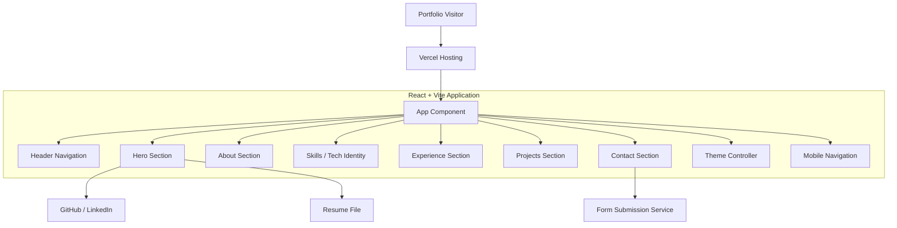

---

## 🔄 Complete Visitor Workflow

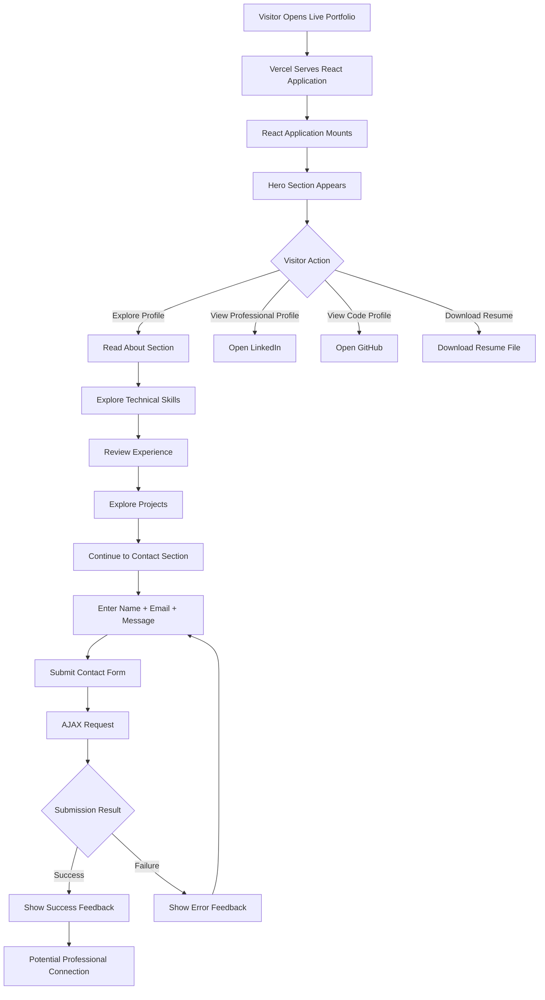

---

## 🧭 Navigation Workflow

The portfolio uses a single-page navigation model.

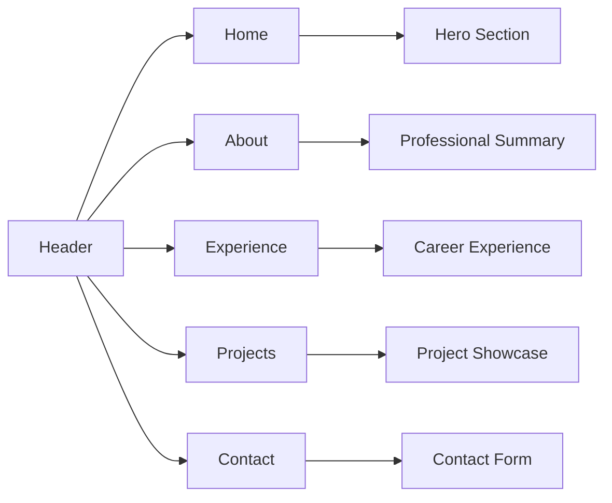

This keeps the browsing experience fast and avoids unnecessary page transitions.

---

## 🦸 Hero Section Workflow

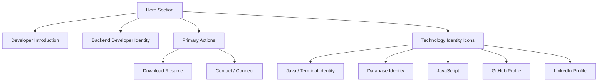

The latest UI evolution gives technology icons premium glassmorphic boxes with individual brand-inspired glow states and hover transformations.

---

## 🎨 Technology Icon Interaction System

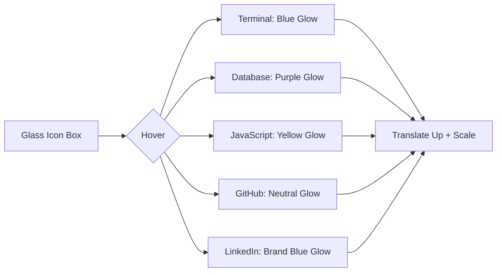

The icon system uses:

- backdrop blur,
- translucent surfaces,
- border transitions,
- radial highlight overlays,
- drop shadows,
- individual brand colors,
- scale animation,
- vertical hover movement,
- theme-specific color behavior.

---

## 🌗 Theme Workflow

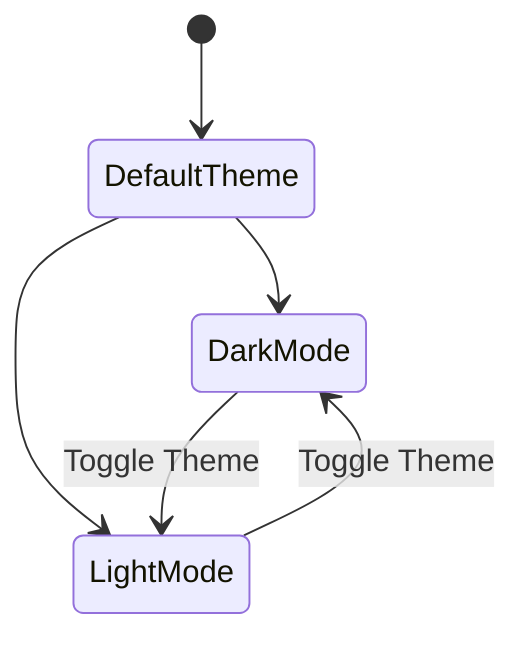

The visual system supports both dark and light themes, with adjusted backgrounds, text contrast, glass surfaces, icon colors, shadows and hover states.

---

## 📱 Responsive Experience

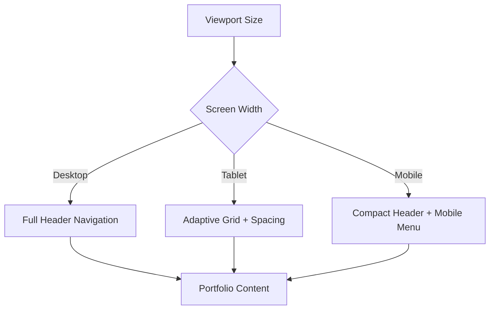

The portfolio adapts navigation, spacing, content layout and interaction areas for multiple screen sizes.

---

## 📬 Contact Form Workflow

The contact section uses asynchronous form submission so visitors can send a message without leaving the portfolio.

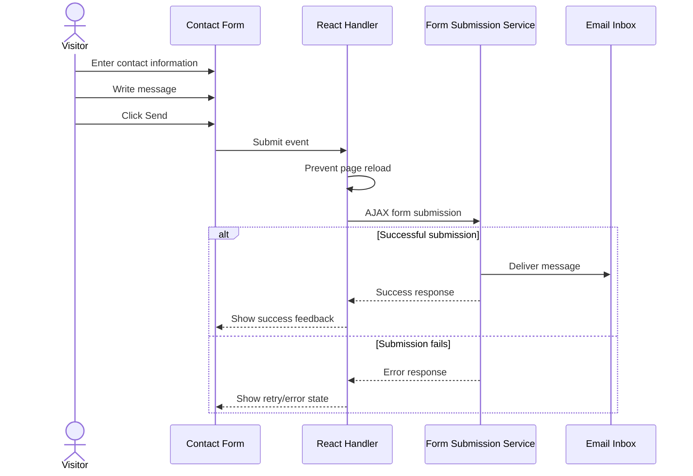

### Contact Pipeline

```text
Visitor
   ↓
Contact Form
   ↓
React Submit Handler
   ↓
AJAX Request
   ↓
Form Delivery Service
   ↓
Configured Email Inbox
   ↓
Success / Error UI Feedback
```

---

## 📄 Resume Download Workflow

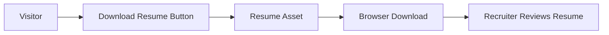

This gives recruiters direct access to the résumé without requiring additional navigation.

---

## 🔗 Social Profile Workflow

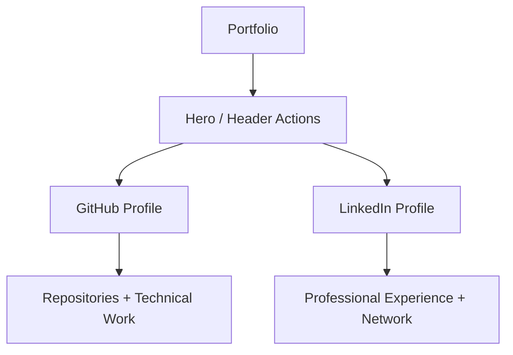

---

## ⚛️ React Application Flow

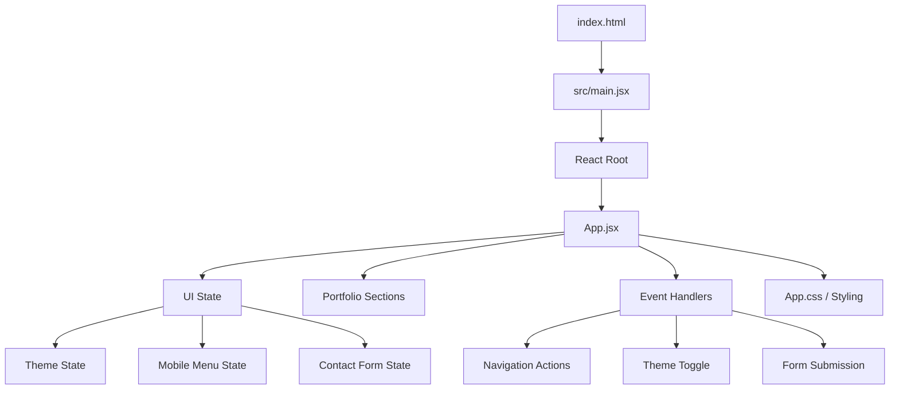

---

## 🧰 Technology Stack

| Technology | Purpose |
|---|---|
| React 19.2 | Component-driven UI |
| React DOM 19.2 | Browser rendering |
| Vite 5.4 | Development server and production build |
| JavaScript | UI behavior and application logic |
| Lucide React | Consistent icon system |
| CSS | Responsive design, themes and animations |
| CSS Custom Properties | Theme-aware design tokens |
| Oxlint | JavaScript and React code quality |
| Form Submission API | Contact-message delivery |
| Vercel | Production deployment |

---

## 📂 Project Structure

```text
Shashank_Portfolio/
│
├── public/
│   ├── favicon.svg
│   └── resume / static assets
│
├── src/
│   ├── App.jsx
│   ├── App.css
│   ├── main.jsx
│   └── assets/
│
├── index.html
├── package.json
├── package-lock.json
├── vite.config.js
├── oxlint.config.json
└── README.md
```

---

## 🔍 SEO & Browser Metadata

The project includes portfolio-oriented browser metadata describing the owner as a backend developer based in Hyderabad, India, with specialization around Java, Spring Boot, Spring Security, REST APIs and PostgreSQL.

```text
Search / Shared Link
        ↓
HTML Metadata
        ↓
Developer Name + Role
        ↓
Technology Specialization
        ↓
Portfolio Discoverability
```

For future improvement, Open Graph and Twitter Card metadata can be added for richer social previews.

---

## 🚀 Run Locally

### 1. Clone the Repository

```bash
git clone https://github.com/ashrithBalaji456/Shashank_Portfolio.git
cd Shashank_Portfolio
```

### 2. Install Dependencies

```bash
npm install
```

### 3. Start Development Server

```bash
npm run dev
```

Open the local URL shown by Vite, typically:

```text
http://localhost:5173
```

### 4. Create Production Build

```bash
npm run build
```

### 5. Preview Production Build

```bash
npm run preview
```

---

## 🌍 Deployment Workflow

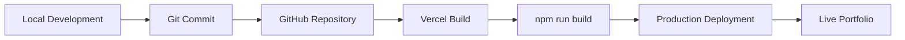

### Production

**Live Portfolio:**  
https://shashank-portfolio-rust.vercel.app/

---

## 🧪 Manual Testing Checklist

- [ ] Portfolio loads correctly on the live deployment.
- [ ] Header navigation reaches the correct sections.
- [ ] Mobile menu opens and closes correctly.
- [ ] Hero CTA buttons work.
- [ ] Resume button downloads or opens the correct résumé.
- [ ] GitHub profile opens in a new tab.
- [ ] LinkedIn profile opens in a new tab.
- [ ] Dark theme renders correctly.
- [ ] Light theme renders correctly.
- [ ] Technology icons animate on hover.
- [ ] Project cards are readable on mobile.
- [ ] Contact form validates required fields.
- [ ] Contact form sends successfully.
- [ ] Success state appears after submission.
- [ ] Failure state is understandable and retryable.
- [ ] Layout works on desktop, tablet and mobile.
- [ ] No horizontal overflow appears on small screens.
- [ ] Production build completes successfully.

---

## 🎯 User Journey

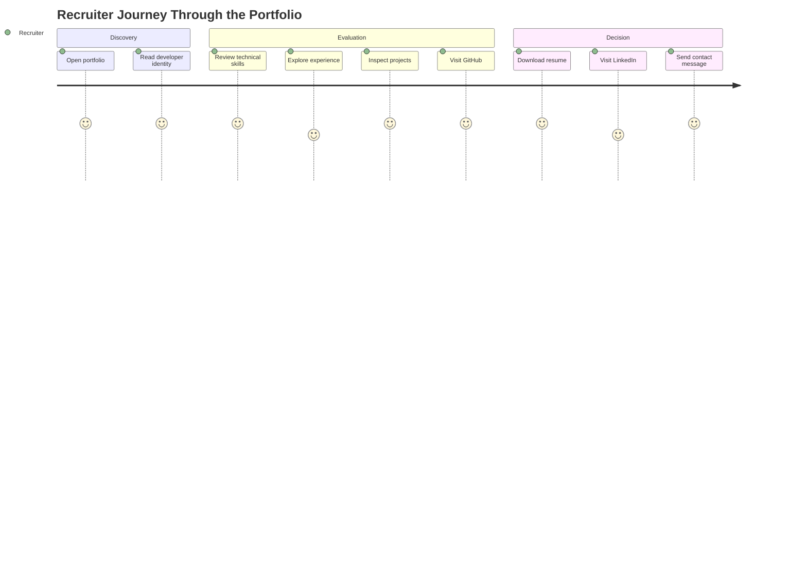

---

## 🧠 Engineering Concepts Demonstrated

This project demonstrates:

- React single-page application development
- Component-driven UI thinking
- State-driven theme management
- Responsive navigation
- Mobile-first adaptation
- Event handling
- Asynchronous form submission
- External service integration
- CSS custom properties
- Glassmorphism
- Micro-interactions
- Hover-state design systems
- Brand-aware icon styling
- Responsive grids
- Semantic portfolio structure
- SEO metadata
- Static production deployment
- Git-based deployment workflow

---

## 🔐 Production Considerations

For further production hardening:

- Keep email-service configuration outside public frontend code where applicable.
- Add bot protection or CAPTCHA to the contact form if spam increases.
- Add rate limiting through a backend/serverless contact endpoint for stronger abuse prevention.
- Add analytics with privacy-aware configuration.
- Add a custom domain.
- Add Content Security Policy headers.
- Add Open Graph metadata.
- Add Twitter/X Card metadata.
- Optimize image assets to WebP or AVIF.
- Add Lighthouse performance checks to CI.
- Add automated accessibility testing.

---

## 📈 Future Enhancements

- [ ] Framer Motion section transitions
- [ ] Animated page loading sequence
- [ ] GitHub API project statistics
- [ ] Dynamic repository cards
- [ ] Blog or technical writing section
- [ ] Project filtering by technology
- [ ] Detailed project case-study pages
- [ ] Certification section
- [ ] GitHub contribution visualization
- [ ] Visitor analytics
- [ ] Custom domain
- [ ] Open Graph social cards
- [ ] PWA support
- [ ] Accessibility audit
- [ ] Lighthouse CI
- [ ] Contact form CAPTCHA
- [ ] Serverless contact API
- [ ] Automated deployment checks

---

## 🔗 Important Links

| Resource | Link |
|---|---|
| 🌐 Live Portfolio | [Visit Live Application](https://shashank-portfolio-rust.vercel.app/) |
| 📦 Source Repository | [Shashank_Portfolio](https://github.com/ashrithBalaji456/Shashank_Portfolio) |
| 👨‍💻 GitHub Profile | [Shashank51-code](https://github.com/Shashank51-code) |
| 💼 LinkedIn | [Shashank Kudha](https://www.linkedin.com/in/shashank-kudha-5ba284252/) |

---

## 👨‍💻 Portfolio Owner

<div align="center">

### Shashank Kudha

**Backend Developer**

Java • Spring Boot • Spring Security • REST APIs • PostgreSQL

<a href="https://github.com/Shashank51-code">
  
</a>
<a href="https://www.linkedin.com/in/shashank-kudha-5ba284252/">
  
</a>

</div>

---

## ⭐ Support

If you like the portfolio design or find the implementation useful for learning React, responsive portfolio design, theme systems and interactive UI development, consider starring the repository.

<div align="center">

### Built with ⚛️ React • ⚡ Vite • 🟨 JavaScript • 🎨 CSS • ▲ Vercel

**Build skills. Showcase work. Create opportunities.**

⭐ Star the repository if you find it useful.

</div>
